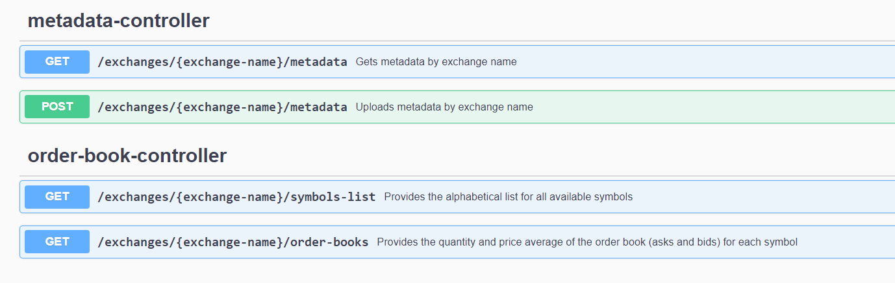

**Prerequisites**:

Git, Maven, Java 17 SDK, MongoDB, Docker latest version, any web browser.

**ARCHITECTURE**

Implementing hexagonal / ports and adapters arch style for the microservice application.
More info on the logic behind implementation [here](https://netflixtechblog.com/ready-for-changes-with-hexagonal-architecture-b315ec967749) and [here](https://www.baeldung.com/hexagonal-architecture-ddd-spring)

**DATABASE**

We're using MongoDB, this particular configuration is set for localhost but should be modified to the instance where the deployed database will be located on deployment.
Collection is *metadata* under the *exchange_db* space. Schemaless provides the flexibility needed for any provider .csv configuration to be uploaded and persisted.
Key is the exchange name.

**SWAGGER**

By default, Swagger is located on port 8080/swagger-ui/index.html
Available endpoints under two different controllers, one for Order Books and one for Metadata

**RUNNING THE APPLICATION**

Application is built with Maven dependencies located at the pom file. 
Running ExchangeDataAggregationApplication will startup Swagger which is the visual entrypoint.
Application can be locally accessed through 
http://localhost:8080/swagger-ui/index.html#/

**DOCKERIZATION**

The application runs its own docker container based off the docker-compose file.
It starts at port 8090 with its own mongoDB instance.
Docker appconfig located in application-docker.yml

**SECURITY**

Spring security in place with simple username / password validation through spring properties file.

***Test considerations***

Given the time, I would refactor how the blocking calls are made and implement reactive calls instead of blocking ones for the different exchanges endpoint calls.
At the current instance and since the prefix stated that it would happen at a later time, the *exchange* parameter is not being used for the order-books controller.
That parameter will be the ruling for which client to use, currently having only *Blockchain.com*, it is not used properly.
I would like to implement apptoken secrets for the requests.